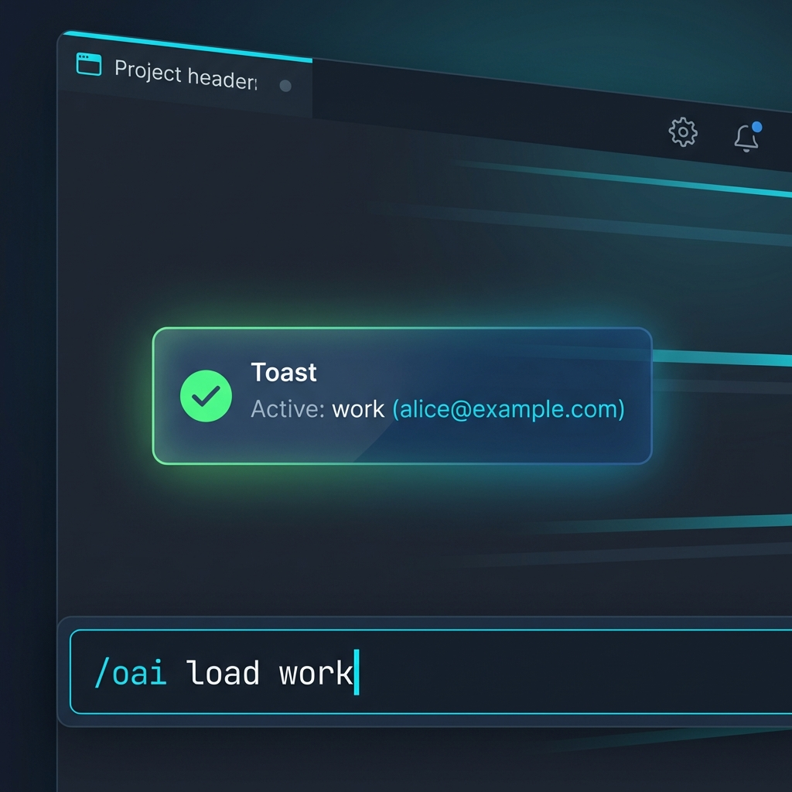

# OpenCode OpenAI Multi-Account Plugin

Плагин для OpenCode, который добавляет ручное переключение между несколькими аккаунтами OpenAI, авторизованными через браузер (ChatGPT Plus/Pro OAuth).

Идея простая:

1. Вы авторизуетесь в OpenCode через `/connect` (OpenAI -> ChatGPT Plus/Pro).
2. Сохраняете текущие OAuth-креды в именованный профиль командой `/oai save <name>`.
3. Еще раз авторизуемся через `/connect` для другого аккаунта и сохраняем еще раз уже под любым другим именем.
4. После добавления всех нужных аккаунтов переключаетесь между ними командой `/oai load <name>`.

## Что делает

- Добавляет команду `/oai` с подкомандами `save/list/del`.
- Хранит несколько OAuth-профилей на диске.
- Переключает активные креды провайдера `openai` без изменения моделей/конфига.

## Принцип работы

Плагин работает с токенами авторизации (OAuth Refresh/Access Tokens):

1.  **Сохранение (`save`):** Плагин читает текущие активные токены OpenCode и сохраняет их в свой локальный файл (`openai-accounts.json`).
2.  **Переключение (`load`):** Плагин берет токены из сохраненного профиля и "скармливает" их обратно в OpenCode через системный API (`client.auth.set`).

**Нужен ли перезапуск?**
Нет. Переключение происходит **мгновенно (на лету)**. OpenCode сразу начинает использовать новый аккаунт для следующих запросов. Перезагружать редактор НЕ нужно.

## Требования

- OpenCode (2026+) с поддержкой plugins.
- Авторизация OpenAI через `/connect` (OAuth, ChatGPT Plus/Pro).

## Установка

Выполните одну команду в терминале:

```bash
bash <(curl -fsSL https://raw.githubusercontent.com/nyxandro/manycodex/main/install.sh)
```

Или, если вы уже клонировали репозиторий:

```bash
chmod +x install.sh && ./install.sh
```

После установки **перезапустите OpenCode**.

### Ручная установка (без скрипта)

Можно установить вручную: достаточно положить **2 файла** в глобальные директории OpenCode.

- Плагин: `plugins/openai-multi.ts` -> `${XDG_CONFIG_HOME:-~/.config}/opencode/plugins/openai-multi.ts`
- Команда: `commands/oai.md` -> `${XDG_CONFIG_HOME:-~/.config}/opencode/commands/oai.md`

После копирования файлов **перезапустите OpenCode**.

## Быстрый старт

**Как добавить несколько аккаунтов:**

1. **Подключите первый аккаунт:**
   Выполните в OpenCode команду `/connect` -> OpenAI -> ChatGPT Plus/Pro. Пройдите авторизацию в браузере.

2. **Сохраните его:**

   ```bash
   /oai save personal
   ```

3. **Смените аккаунт:**
   Снова выполните `/connect`. В браузере **выйдите** из старого аккаунта и войдите во **второй**. OpenCode подцепит новые данные.

4. **Сохраните второй аккаунт:**

   ```bash
   /oai save work
   ```

5. **Переключайтесь:**
   ```bash
   /oai load personal  # переключиться на личный
   или
   /oai load work      # переключиться на рабочий
   ```

## Команды

- `/oai` или `/oai list` — показать список сохраненных профилей (все ответы выводятся в Toast OpenCode; активный профиль помечен как `[name]`).
- `/oai save <name>` — сохранить **текущий** активный аккаунт в профиль с именем `<name>`.
  - Если имя занято, вернется ошибка (защита от перезаписи).
- `/oai load <name>` — загрузить профиль (сделать активным).
- `/oai del <name>` — удалить профиль.

## Где хранятся данные

- Активные креды OpenCode: `~/.local/share/opencode/auth.json`
- Профили плагина: `~/.config/opencode/openai-accounts.json`

## Безопасность

В профилях содержатся OAuth-токены.

- НЕ коммитьте `~/.config/opencode/openai-accounts.json` и `~/.local/share/opencode/auth.json`.
- Если токен утек (скрин, лог, paste) — перелогиньтесь через `/connect`.

## Лицензия

MIT (см. `LICENSE`).
